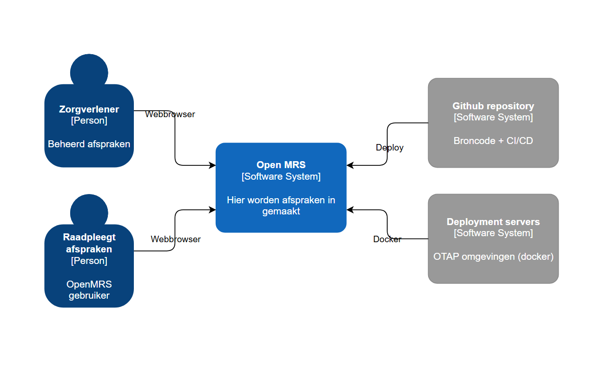
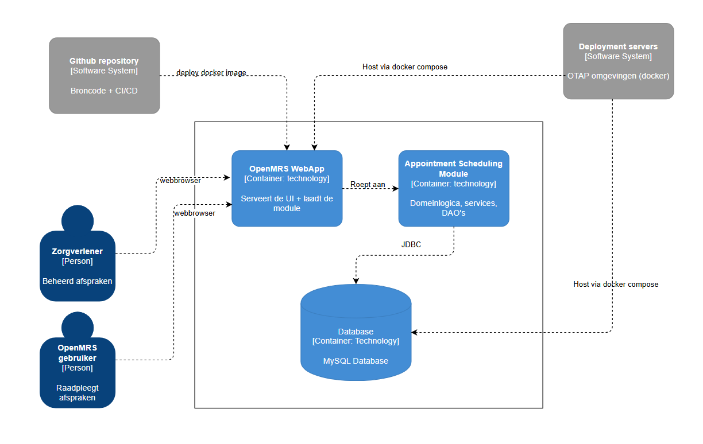

# C1 / C2 Architectuurmodel — OpenMRS Appointment Scheduling

---

## C1 — Systeemcontextdiagram

Het C1-diagram toont het systeem als één geheel, omgeven door de externe actoren en systemen waarmee het interacteert.

### Toelichting C1

| Actor / Systeem | Rol |
|---|---|
| **Zorgverlener / Beheerder** | Primaire gebruiker; plant en bekijkt afspraken via de browser |
| **OpenMRS gebruiker** | Raadpleegt afspraken via de browser |
| **OpenMRS Appointment Scheduling** | Het centrale systeem — scope van dit diagram |
| **GitHub repository** | Broncode-opslag en CI/CD-workflows |
| **Deployment servers** | OTAP-omgevingen; hosten de applicatie via Docker Compose |

---

## C2 — Containerdiagram

Het C2-diagram toont de interne technische bouwstenen (containers) van het systeem en hoe ze met elkaar communiceren.

### Toelichting C2

| Container | Technologie | Verantwoordelijkheid |
|---|---|---|
| **OpenMRS WebApp** | Java 7, Tomcat 8.0.53 | Serveert de UI; laadt de `.omod` module bij opstart |
| **Appointment Scheduling API** | Java, Spring, Hibernate | Domeinlogica en persistentie (ingebed in de WebApp) |
| **MySQL Database** | MySQL 8.0 | Relationele opslag; alleen bereikbaar binnen het interne Docker-netwerk |
| **GitHub Actions + GHCR** | (extern) | Bouwt de Docker image en deployt deze via SSH naar de doelserver |

### OTAP-omgevingen

Dezelfde containers draaien in elke omgeving, met omgevingsspecifieke configuratie via `BUILD_ENV`:

| Omgeving | Compose-bestand | Poort | JVM-heap | Debug |
|---|---|---|---|---|
| Development | `docker-compose.dev.yml` | 8080 | 512 m / 256 m | JDWP :5005 |
| Test | `docker-compose.test.yml` | 8081 | 1024 m / 512 m | — |
| Acceptance | `docker-compose.acceptance.yml` | 8082 | 1024 m / 512 m | — |
| Production | `docker-compose.prod.yml` | 8080 | 2048 m / 1024 m | — |
